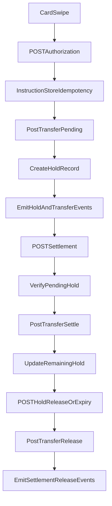

# OpenCoreOS Ledger Prototype (FastAPI + SQLite)

This project is a Python prototype for an OpenCoreOS-style financial workflow with:

- append-only, double-entry ledger transfers
- idempotent instruction execution
- two-phase hold lifecycle (`pending -> settled | voided | expired`)
- event emission for downstream consumers

It implements the core interview scenario:

1. authorize a `$50` hold
2. settle `$48`
3. release `$2`

## Architecture

### Components

- `app/main.py`  
  FastAPI app factory and HTTP routes.
- `app/services/ledger_service.py`  
  Atomic, balanced transfer posting and balance projection.
- `app/services/instruction_service.py`  
  Idempotency key handling and instruction persistence.
- `app/services/workflow_service.py`  
  Authorization, settlement, hold release, expiry orchestration.
- `app/services/event_bus.py`  
  Event publisher abstraction (stored in DB for prototype).
- `app/storage/sqlite_repo.py`  
  SQLite repository, schema, and transaction boundaries.

### Data flow



## Accounting Model

Prototype accounts:

- `acct_customer_checking` (debit-normal)
- `acct_customer_holds` (debit-normal)
- `acct_merchant_clearing` (debit-normal)
- `acct_bank_funding` (credit-normal, bootstrap funding source)

Transfer patterns:

- **Authorization**
  - debit `customer_holds`
  - credit `customer_checking`
- **Settlement**
  - debit `merchant_clearing`
  - credit `customer_holds`
- **Hold release**
  - debit `customer_checking`
  - credit `customer_holds`

The ledger is append-only. No transfer row is mutated; compensating transfers are added when needed.

## API

- `POST /instructions/authorization`
- `POST /instructions/settlement`
- `POST /instructions/hold-release`
- `GET /accounts/{account_id}/balances`
- `GET /instructions/{instruction_id}`
- `POST /internal/holds/release-expired` (prototype scheduler hook)
- `GET /internal/health`
- `GET /internal/metrics`
- `GET /internal/replay/verify`
- `GET /internal/reconciliation/report`

Each write instruction requires `idempotency_key`.

## Observability and Failure Signals

- Every request gets `x-request-id` and `x-elapsed-ms` response headers.
- Clients may pass `x-request-id`; otherwise the service generates one.
- Business/validation failures emit `instruction.failed` events with:
  - instruction type
  - idempotency key
  - error type/message
  - request id
  - request payload
- Failed instructions are also mirrored to `instruction.dlq` for operational triage.
- `GET /internal/metrics` summarizes event counts and failure counts by error type.
- `GET /internal/replay/verify` performs a replay safety check and emits `replay.verified`.
- `GET /internal/reconciliation/report` checks hold ledger parity and emits `reconciliation.completed`.
- Core ledger writes remain atomic; no partial transfer posting.

## Optional AI Usage (Lean)

AI-style risk scoring is optional and event-only:

- Enable with `ENABLE_AI_RISK_CHECK=1`
- Optional scorer mode: `RISK_SCORER_MODE=heuristic|ai` (default: `heuristic`)
- Optional provider hint for AI mode: `AI_RISK_PROVIDER=<name>`
- Runs after successful authorization
- Emits `fraud.risk_assessed`
- Does not block or alter ledger writes

Default is off, keeping core ledger execution deterministic.
If AI mode is selected but no provider is configured, it falls back to heuristic scoring.

## Run

Install dependencies:

```bash
python -m pip install -e ".[dev]"
```

Start API:

```bash
uvicorn app.main:app --reload
```

Enable optional risk scoring:

```bash
set ENABLE_AI_RISK_CHECK=1
uvicorn app.main:app --reload
```

Enable AI mode with safe fallback:

```bash
set ENABLE_AI_RISK_CHECK=1
set RISK_SCORER_MODE=ai
set AI_RISK_PROVIDER=demo
uvicorn app.main:app --reload
```

Run tests:

```bash
pytest
```

## Test Coverage

Tests are in `tests/` and include:

- authorization path
- full settlement + release flow (`50 -> 48 -> 2`)
- idempotency replay and payload conflict
- over-settlement rejection
- automatic expiry release
- observability headers + failure events + DLQ mirroring
- replay verification and reconciliation reporting endpoints

## Trade-offs

- SQLite and in-DB events are used for simplicity; production should use a durable event bus (Kafka/Redpanda/NATS).
- Risk scoring currently uses a lean heuristic scorer behind a feature flag; swap the scorer implementation when a real AI service is needed.
- Balance reads are projected from entries each time; production should use materialized projections for scale.
- Expiry processing is exposed as an internal endpoint; production should run this as scheduled background work.
